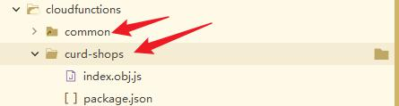

**1、先首页app的几个底部页面框架**

**2、逐个页面进行开发，上传ui图片，让GPT生成单个页面的首页。然后再让GPT生成codex的任务，增加详情页和新建页面的操作**

【任务卡】负责的店：新增门店 + 详情页编辑
背景

项目：be-crm（uni-app / mp-weixin，Vue2 选项式）。

现状：pages/my-shops/index.vue 已能展示门店列表并跳到 detail.vue。

目标：

在“负责的店”（pages/my-shops/index.vue）增加新建门店按钮；

在“门店详情”（pages/my-shops/detail.vue）支持修改门店基本信息；

暂不做删除功能、暂不接后端。数据用 uni.setStorageSync('shops_mock') 持久化，便于调试。

变更清单

pages.json：新增两个页面

pages/my-shops/create（新建）

pages/my-shops/edit（编辑）

index.vue：右下浮动按钮「+ 新增门店」→ 跳 create

create.vue：表单 + 校验 + 保存到本地存储

detail.vue：右上「编辑」按钮 → 跳 edit?id=xxx

edit.vue：载入 id → 表单回显 → 保存回本地存储

storage 工具（可内置到各页或抽一个 utils/shopsStore.js）

loadShops() / saveShops(list) / genId() / findById(id) / upsert(shop)

字段定义（前端表单）
{
  _id: string,                 // 唯一ID，本地用时间戳/随机串
  store_name: string,          // 门店名称（必填）
  store_address: string,       // 地址（必填）
  phone: string,               // 电话（可选）
  business_hours: string,      // 营业时间（默认 '10:00 - 22:00'）
  cover_image: string,         // 顶图URL（可选）
  customer_count: number,      // 客户数（只读，默认 0）
  month_revenue: number,       // 上月营收（只读，默认 0）
  status: 'active' | 'closed'  // 状态（默认 active）
}

pages.json 改动

在 pages 数组尾部追加（不要覆盖已有项）：

{ "path": "pages/my-shops/create", "style": { "navigationBarTitleText": "新增门店" } },
{ "path": "pages/my-shops/edit",   "style": { "navigationBarTitleText": "编辑门店" } }

index.vue（负责的店）改动

页面右下新增悬浮按钮（不遮挡列表）：

<view class="fab" @tap="goCreate">＋</view>

.fab {
  position: fixed; right: 16px; bottom: 88px;
  width: 52px; height: 52px; border-radius: 26px;
  background: #caa265; color: #fff; font-size: 28px;
  display:flex; align-items:center; justify-content:center;
  box-shadow: 0 8px 16px rgba(0,0,0,.15); z-index: 10;
}

methods: {
  goCreate() { uni.navigateTo({ url: '/pages/my-shops/create' }) },
  // openDetail 保持不变
}

列表数据的来源：优先从 uni.getStorageSync('shops_mock') 读取；若为空，回退到现有的内置 mock。进入页面 onShow 时刷新一次。

新建页：pages/my-shops/create.vue

Vue2 选项式；表单元素可用原生 <input>/<textarea> 或 uni-forms；必填校验：store_name、store_address。

点击「保存」：

读取 shops_mock 数组 → 生成 _id → unshift 到列表 → save；

uni.showToast({ title: '创建成功' })；

uni.navigateBack() 返回列表。

表单按钮：主按钮「保存」、次按钮「取消」。

编辑页：pages/my-shops/edit.vue

onLoad({ id })：从 shops_mock 找到记录并回显。找不到 → toast 并 navigateBack。

点击「保存」：更新对应项（根据 _id 覆盖），写回 shops_mock，toast 成功后 navigateBack()。

编辑字段与创建相同。customer_count、month_revenue 保持只读显示即可（或不在表单中出现）。

详情页：pages/my-shops/detail.vue 改动

右上加「编辑」入口（可用自定义按钮或在页面内容中加按钮）：

<view class="edit-btn" @tap="goEdit">编辑</view>

.edit-btn { position: fixed; right: 16px; top: 8px; color:#caa265; padding:8px 12px; }

methods: {
  goEdit() { uni.navigateTo({ url: `/pages/my-shops/edit?id=${this.id}` }) }
}

onShow 时尝试根据 id 重新从 shops_mock 取数据，确保编辑后返回能刷新。

本地存储工具（可内联或新建 utils/shopsStore.js）
const KEY = 'shops_mock'
export function loadShops(fallback=[]) {
  try { const s = uni.getStorageSync(KEY); return Array.isArray(s) && s.length ? s : fallback } catch(e){ return fallback }
}
export function saveShops(list) { uni.setStorageSync(KEY, list || []) }
export function genId(){ return String(Date.now()) + Math.random().toString(16).slice(2,8) }
export function findById(list, id){ return list.find(i => i._id === id) }
export function upsert(list, shop){
  const i = list.findIndex(x => x._id === shop._id)
  if (i >= 0) list.splice(i, 1, shop); else list.unshift(shop)
  return list
}

**3、在cloudfunctions下新建云对象，并关联uni-id-common关联**

4、

在“新建门店”信息时候，填写门店信息后点击“保存”按钮时，通过云对象curd-shops文件夹下的 @index.obj.js 以及用户uid，
将新增的门店的信息数据新增到云数据库 @shops.schema.json 中，并且将该用户在云数据库 @shops.schema.json 中所有的门店信息页面上的记录，
可以通过云对象 @index.obj.js 与该用户uid查询并调用呈现在my-shops/index.vue页面中，如果能正常读取后端数据库信息就显示数据库中信息，不显示模拟的数据信息。